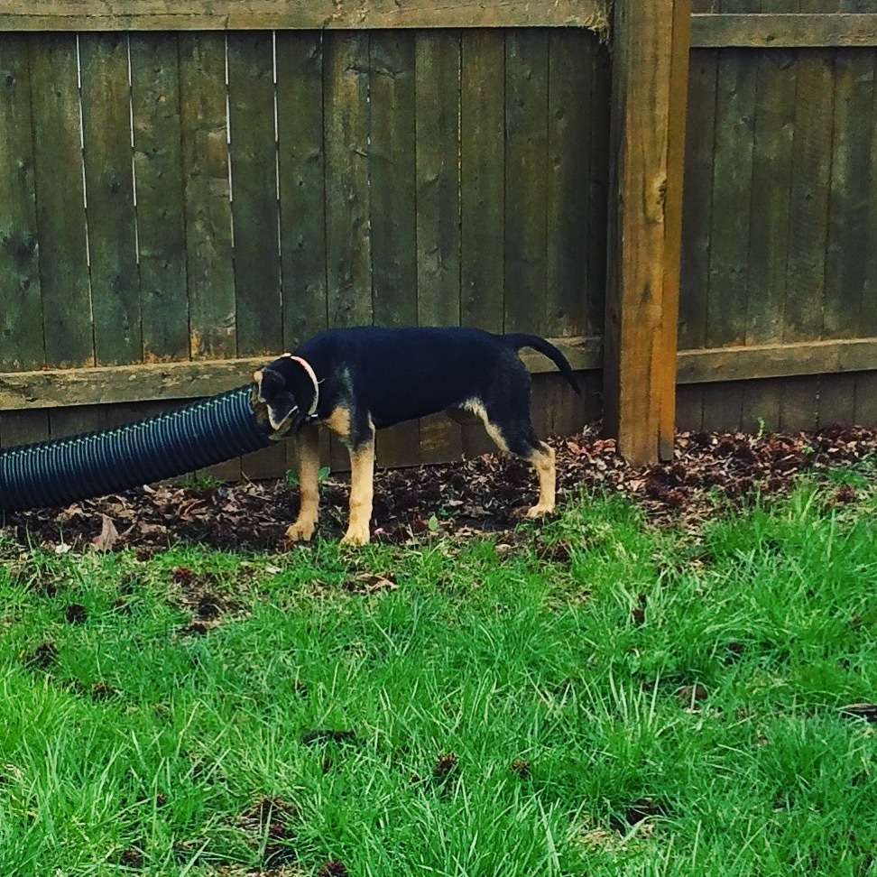

I had been in the rescue world for almost 2 years when we first started fostering and had gotten to know there are some dogs that our fearless leader pulls that have “I am going to break your heart” written all of their faces. Kat was one of them. She came in with her brother “Kit” and had been picked up by animal control because they were bricked into one of those dog house igloos and only fed and watered once every few days. Kat was tiny and completely malnourished.. she was the less dominant of the two and Kit would eat most of the food. I had been going back and forth on fostering for a while and had just gotten the “lets give it a shot” from my boyfriend when our rescue leader called and said, I am going to to pull these puppies, do you want to foster the small one? I agreed and headed to the rescue to get her. I had been warned about her physical shape, but her emotional shape was something I wasn’t prepared for. She was not a fan of mine at all. She quickly attached to our dogs, but would side eye Craig and I from across the room and never come over for pets or snuggles.

Thankfully, she learned by example pretty quickly. Our dogs are “cuddle hogs” constantly pushing each other out of the way to sit the closest to us and get lovins. The first time she wagged her  tail at Craig when he got home from work I think I burst into tears. Slowly but surely she came around to first allowing us to pet her at all,  then seeking out the pets and finally pushing her way through Ace and Ally to get the attention they got. She put on weight, got healthier day by day, and finally was strong enough to get all of her puppy shots and spayed in order to start the search for her forever home.

The part I had been dreading about fostering was how attached I would get and how hard it would be to let them go when it came time for them to move on from my family to their own. I won’t lie and say watching them leave has gotten easier the longer we do this and the more dogs we place. I cry every time. I am worried for them and worried for their new families and want so desperately for them to live as safe and happy of a life in their new home as they had with me, crying is inevitable. Kat was adopted by a family that I have known for years. I knew what kind of dog owners they were and I had no doubt they would be Kat’s forever family. I still cried when she left.

What I wish more people who adopted dogs understood, is how attached the rescuers get to these dogs. Kat’s family is an exception to that. I get videos, pictures, texts and have even visted her a few times. They tell me often that she is the best dog and that they love her. Those texts make all the tears and worry from Kat’s time with us worth every second. I couldn’t have asked for a better first foster experience than I got with Kat.